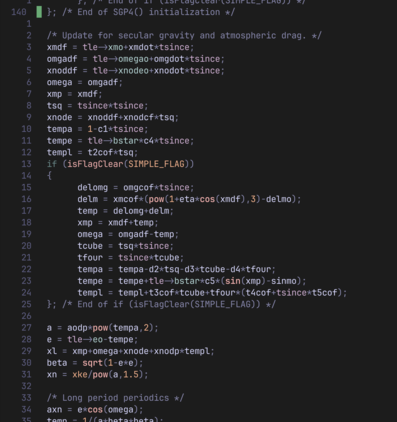

# Simple Satellite Operations tools

A set of tools dedicated to predicting and tracking satellite passes near a
ground station.

## simple_sat_ops
<untested>

Uses Hamlib to control antenna rotator and transceiver for satellite
communications over UHF and VHF.

## next_in_queue

Prints upcoming overpasses of satellites from a file of TLEs.

## lifetime 

Estimates the lifetime of a satellite from TLE the alone. Inaccurate: this is
a toy "what if?" calculation. In SGP4SDP4, orbit decay is apparently modelled
empirically based on measurement of the rate of change of the mean anomaly and
its rate of change. See the sgp4sdp4 source code and related references for
details.

