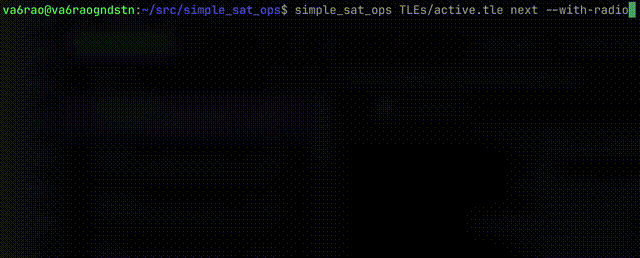
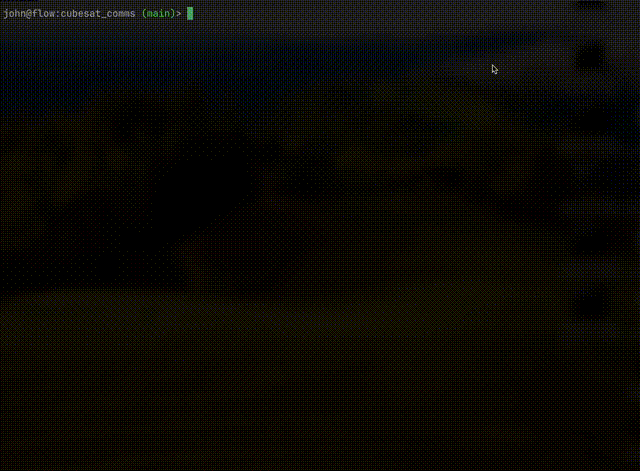

# Simple Satellite Operations tools

A set of tools dedicated to predicting and tracking satellite passes near a
ground station.

## simple_sat_ops
<untested>

Custom drivers control the SPIG Rot2Prog antenna rotator and Icom IC-9700 transceiver for satellite
communications over UHF and VHF.

## next_in_queue

Prints upcoming overpasses of satellites from a file of TLEs.

## lifetime 

Estimates the lifetime of a satellite from TLE alone. Inaccurate!

