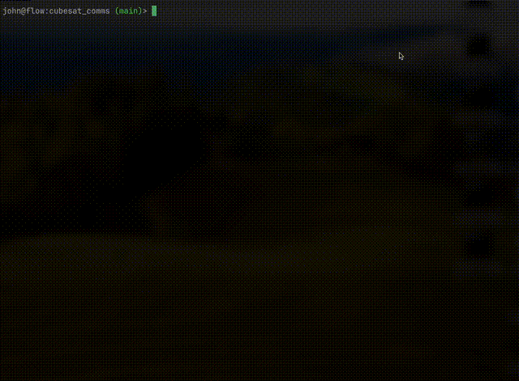

# Simple Satellite Operations tools

A set of tools for predicting and tracking satellite passes near a ground
station, and for running a complete software-defined-radio link to a
cubesat: receive, decode, transmit telecommands, and point the antenna.

The software was built for the University of Calgary
[CalgaryToSpace](https://www.calgarytospace.ca) FrontierSat ground station.

The aim is twofold: 1) demonstrate reliable, fast operation through a simple
terminal interface, and 2) learn by doing. The software suits our needs;
your mileage may vary.

> **History.** This project began as a CAT-controlled-radio tracker (Yaesu
> FT-991A, ICOM IC-9700). That radio path has been **retired** — the RF
> chain now runs entirely through the SDR. The full story is in the git
> history; see Appendix B of [`docs/USER_MANUAL.md`](docs/USER_MANUAL.md),
> which is the comprehensive field guide to every tool here.

## simple_sat_ops

`simple_sat_ops` is the single live-RF program: an ncurses operator UI that
predicts the pass, drives the SPID Rot2Prog antenna rotator, receives and
decodes the downlink (AX100 → CSP), transmits telecommand bursts, and fans
the whole pass out to read-only viewers over a local socket — one process,
no separate daemon.

```bash
# Pick a satellite by name prefix
simple_sat_ops TLEs/amateur.tle "ISS (ZARYA)"

# Let it pick the next visible pass that meets your criteria
simple_sat_ops TLEs/amateur.tle next --min-elevation=10

# With the antenna and SDR attached
simple_sat_ops TLEs/amateur.tle next --with-hardware
```

Hardware is opt-in: `--with-rotator`, `--with-hardware`. Without those flags
the UI runs as a tracking/viewer client. Pass `--without-b210` to skip the
SDR entirely on a dev host.



*Early demo — the tracking UI predates the SDR cutover, but the pass display
is the same one in use today.*

## SDR backends

The baseband SDR is chosen with `--sdr-type=uhd | rtlsdr | auto` (default
`auto`: probe UHD, then RTL-SDR; first that opens wins).

- **USRP B210** (`uhd`, needs `libuhd`) — full RX **and** TX.
- **RTL-SDR** (`rtlsdr`, needs `librtlsdr`) — **RX-only**; every operator
  command works except transmit.

Run **`sdr_probe`** before a pass to confirm what is attached and which FPGA
image a B2xx clone will load. `--uhd-args=`, `--sdr-fpga=`, and
`--sdr-device=` override device selection per run.

## TX safety

Transmit is **inhibited by default** so refactors and bring-up runs can't
accidentally key the PA. Keying requires `--allow-tx` (or ticking the
`allow-tx` box in the TX-compose / auto-command modals). Releasing TX is
never blocked.

## Other tools

| Tool | What it does |
|------|--------------|
| `next_in_queue` | Print upcoming overpasses from a file of TLEs (no hardware needed). |
| `sdr_probe` | Report the attached SDR(s) and the RX/TX ports `simple_sat_ops` will use. |
| `packet_browser` | ncurses explorer over the decoded-packet database; reconstructs and exports downlinked files. |
| `tcmd_browser` | The inverse: browse transmitted telecommands and the responses they drew. |
| `agenda_check` | Lint a telecommand agenda file against the flight firmware's command set. |
| `decode_inspector` | Staged decoder visualizer (ASM → Golay → descrambler → Reed-Solomon → CSP); raylib. |
| `live_waterfall` | Real-time spectrogram; raylib. |
| `tle_keps` | Orbital-elements summary (apogee/perigee, period, sun-sync, LTAN/LTDN). |
| `gnss_opm` / `gnss_reports` | Turn a downlinked GNSS fix into a CCSDS orbit message for space-safety upload. |
| `ham_listen` / `ham_speak` | Amateur-band voice receive/transmit helpers. |
| `lifetime` | Toy orbit-decay estimate (**inaccurate** — a "what if?" only). |

# Installation

CMake, out-of-tree:

```bash
mkdir -p build && cd build
cmake ..
make install
```

Binaries install to `$HOME/bin`. Which tools get built depends on which
optional libraries are present; CMake auto-detects each via `pkg-config`.

Install the **`-dev`** packages so the headers and `.pc` files are present.

Ubuntu/Debian:

```bash
sudo apt install build-essential cmake pkg-config \
    libncurses-dev libssl-dev libsqlite3-dev \
    libuhd-dev librtlsdr-dev libusb-1.0-0-dev libsndfile1-dev libraylib-dev
```

macOS (Homebrew):

```bash
brew install cmake pkg-config ncurses openssl sqlite uhd librtlsdr \
    libusb libsndfile raylib
```

A Mac dev host with neither SDR library still builds the non-RF tools
(`next_in_queue`, `tle_keps`, the unit tests, …); the SDR backends are soft
and turn themselves off if their library is missing.

The bundled [`sgp4sdp4`](https://github.com/KJ7LNW/sgp4sdp4) orbit library
is a separate CMake project that must be built and installed first — see
`sgp4sdp4/README.md`.

## Graphical tools over SSH (raylib OpenGL 2.1 rebuild)

`decode_inspector` and `live_waterfall` are raylib apps. raylib's default
build asks GLFW for an OpenGL 3.3 core context. Vanilla SSH X11 forwarding
(`ssh -X` / `ssh -Y`) only carries GLX 1.x and can't transport that context
request — you get `GLX: An OpenGL profile requested but
GLX_ARB_create_context_profile is unavailable` and the window won't open.

The fix is to rebuild raylib for OpenGL 2.1, which fits inside GLX 1.x:

```bash
# In the raylib source tree (apt-installed sources, a git clone, etc.):
mkdir -p build && cd build
cmake -DOPENGL_VERSION=2.1 \
      -DBUILD_EXAMPLES=OFF \
      -DBUILD_SHARED_LIBS=ON \
      -DCMAKE_BUILD_TYPE=Release \
      ..
make -j
sudo make install            # /usr/local by default
sudo ldconfig

# Sanity check — should report the /usr/local copy first:
pkg-config --variable=prefix raylib
```

Then re-cmake the simple_sat_ops build so it picks the new raylib up:

```bash
cd /path/to/simple_sat_ops/build
rm -f CMakeCache.txt
cmake ..
make -j decode_inspector live_waterfall
```

`decode_inspector` picks GLSL 120 vs 330 for its colour-map shader at runtime
via `rlGetVersion()`, so the same source tree builds and runs against either
raylib variant.

If you want to keep the apt-installed raylib alongside the 2.1 one, give
the 2.1 build a custom prefix (`-DCMAKE_INSTALL_PREFIX=/opt/raylib-21`) and
prefix the simple_sat_ops cmake with
`PKG_CONFIG_PATH=/opt/raylib-21/lib/pkgconfig:$PKG_CONFIG_PATH`; at runtime
set `LD_LIBRARY_PATH=/opt/raylib-21/lib`.

# Credits

Orbit propagation is the [sgp4sdp4 library](https://github.com/KJ7LNW/sgp4sdp4),
ported to C by Neoklis Kyriazis from other sources. Thank you
[@KJ7LNW](https://github.com/KJ7LNW) for making it available on GitHub.

**CAUTION**: the original sgp4sdp4 COPYING file is dated 2001. We have not
checked whether this version of sgp4sdp4 is still consistent with that
recommended by [Vallado et al.
2006](https://celestrak.org/publications/AIAA/2006-6753/AIAA-2006-6753-Rev3.pdf).

Thanks to the University of Calgary [Rothney Astrophysical
Observatory](https://science.ucalgary.ca/rothney-observatory) staff and the
[CalgaryToSpace](https://www.calgarytospace.ca) RF communications lead (as of
Feb 2025) for logistics and technical support while testing this software on
the FrontierSat ground station equipment.

Satellite radio data as of 4 March 2025 courtesy
[JE9PEL](http://www.ne.jp/asahi/hamradio/je9pel/satslist.csv).
