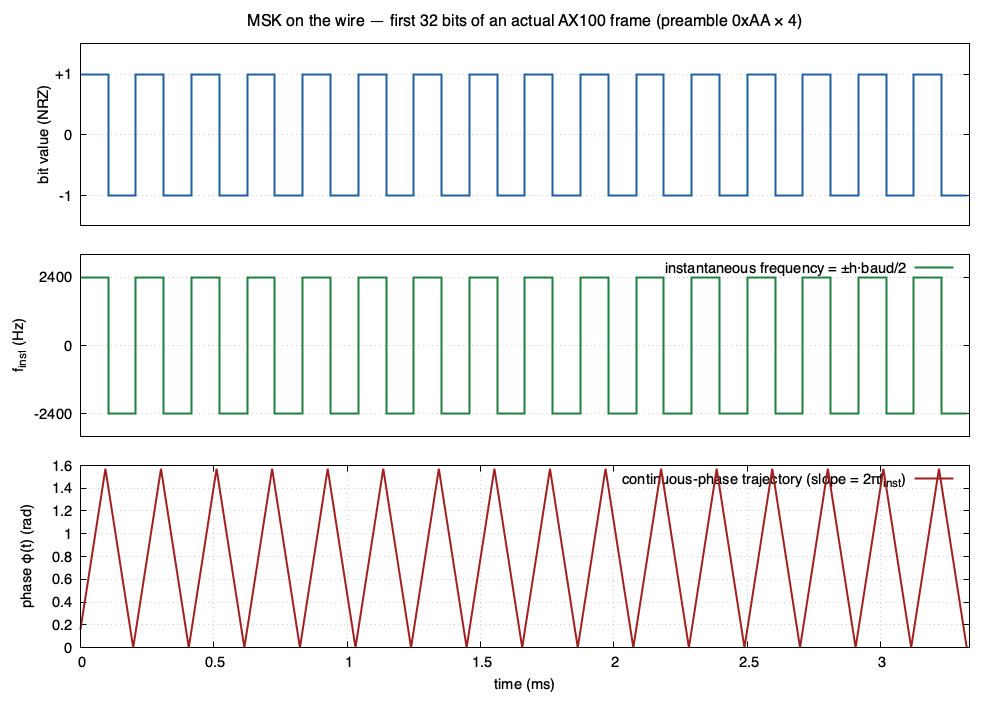
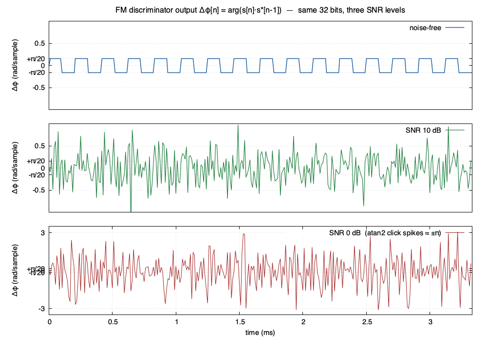
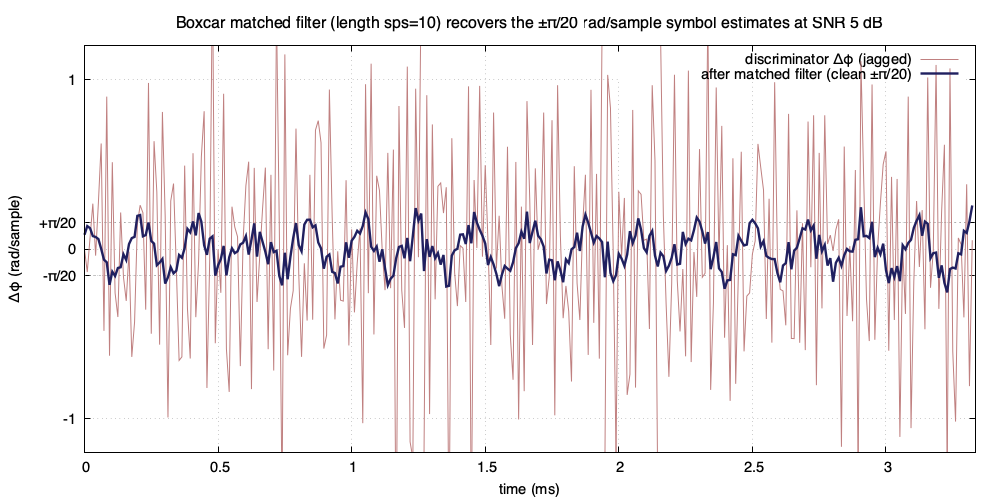
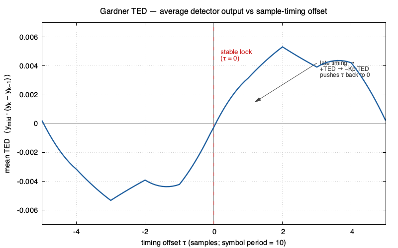
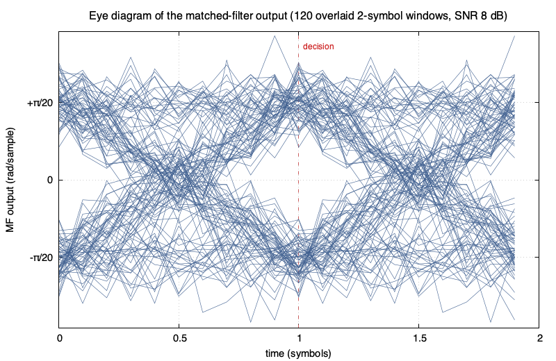
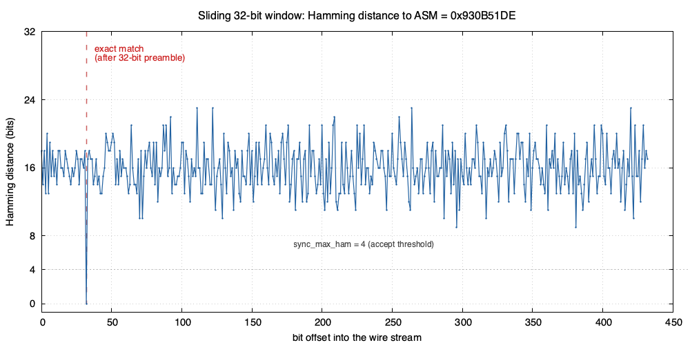
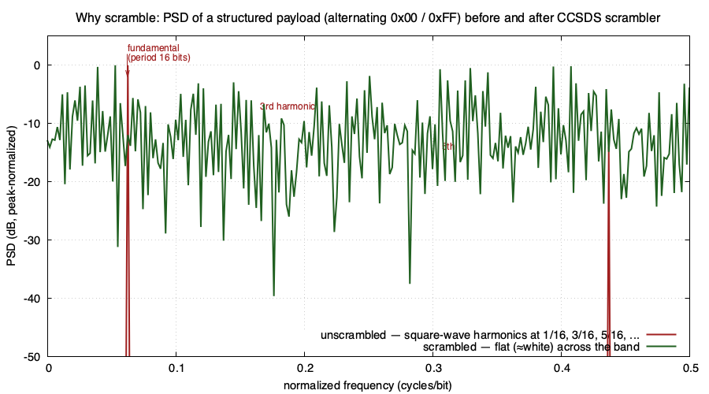
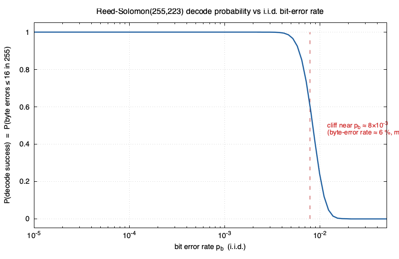

# Decoding a Satellite Downlink, From RF to Plaintext

A tutorial for physicists who haven't done communications engineering before.
Walks through what happens between a 436 MHz photon hitting the antenna and
a printable string of telemetry appearing on the operator's screen.

## 0. The big picture

Decoding is the reverse of all the encoding steps the satellite did to make
its bits survive the trip. Each arrow is a small algorithm forced on us by
the physical channel (noise, Doppler, timing uncertainty) or by an upstream
encoder that traded raw data rate for robustness.

```
RF wave at ~436 MHz
  │  antenna + analog frontend + ADC + I/Q mixer
  ▼
complex baseband samples (96 kHz)
  │  FM discriminator
  ▼
real-valued "instantaneous frequency" stream
  │  matched filter
  ▼
soft symbol estimates
  │  timing recovery + slicer
  ▼
raw bits
  │  sync word (ASM) search
  ▼
framed bits
  │  Golay(24,12) length decode
  ▼
known-length bytes
  │  CCSDS descrambler
  ▼
plaintext bytes
  │  Reed-Solomon(255,223) decoder
  ▼
error-corrected payload
  │  CSP packet parser
  ▼
header fields + application string ("Hello from CalgaryToSpace FrontierSat")
```

The rest of this document walks down that chain. Code references are to
files in this repository; everything described here runs live in
`simple_sat_ops` and offline in `utils/rx_replay`.

### Worked example

The figures throughout this document are generated from an actual
CSP-over-AX100 frame built by the same C encoders the satellite would use.
A short beacon `"CTS1 beacon"` is wrapped in a CSP header (src 5, dst 10,
dport 9), then `ax100_frame()` runs Reed-Solomon, the CCSDS scrambler,
prepends the Golay length header, prepends the ASM, and pads with a 4-byte
0xAA preamble. The 58 bytes that come out are what would be on the wire:

```
preamble (4 bytes):  AA AA AA AA
ASM      (4 bytes):  93 0B 51 DE
Golay    (3 bytes):  7E 80 2F
payload  (47 bytes, scrambled + RS):
  75 EA 4E C0 D9 59 23 8D AE 4E F6 CC C4 D8 28 74
  B0 77 33 D7 DC 3D 6C DC 83 3B D4 A3 D5 DE DC 8F
  DF 88 68 A6 82 AA 4A AC FF 9C 4B 69 E6 5A 1E
```

The figure-data generator and build script live next to this document
(`gen_figdata.c`, `make_figures.sh`).

## 1. From antenna to complex baseband

The satellite transmits a passband signal centered at f_c ≈ 436.150 MHz.
The radio (USRP B210) tunes to f_c and uses an analog quadrature mixer to
multiply the antenna voltage v(t) against both cos(2π f_c t) and
sin(2π f_c t), low-pass filtering each:

```
I(t) = LPF{ v(t) · cos(2π f_c t) }
Q(t) = LPF{ v(t) · sin(2π f_c t) }
```

This is the same idea as a lock-in amplifier, but with two phases. Pack the
two into a single complex number `s(t) = I(t) + i Q(t)` and a passband
sinusoid at frequency `f_c + Δf` becomes a complex exponential
`e^(i 2π Δf t)` at baseband — i.e. positive Δf means above the tuner,
negative below. Doppler shows up as a slow drift of the baseband carrier.

The B210 delivers complex IQ samples to the host at 480 kHz (set by
`uhd_usrp_set_rx_rate` in `b210_rx_tx_core.c`); a software FIR in
`fir_decim.c` decimates that by 5 to 96 kHz. With a 9600 baud symbol rate
that gives us **10 samples per symbol** — comfortable headroom for the
algorithms below.

## 2. What's actually on the wire — 2-FSK

FrontierSat uses **binary frequency-shift keying**:

- bit `1` → transmit a tone at `+2400 Hz` relative to carrier for one symbol period
- bit `0` → transmit a tone at `−2400 Hz` for one symbol period
- symbol rate 9600 baud (one bit per symbol)

The dimensionless **modulation index** is

```
h = 2 · deviation / baud  =  2·2400 / 9600  =  0.5
```

`h = 0.5` is **MSK** — minimum-shift keying, the narrowest-bandwidth FSK
that still keeps the two tones orthogonal over a symbol period, with a
continuous phase trajectory across symbol boundaries (no spectral
splatter). It's the standard setting for the GomSpace AX100 modem the
satellite uses, and the gold-standard ground station's GNU Radio chain
sets `fdev = baud_rate / 4 = 2400 Hz` to match.

Why FSK at all? Bits are encoded in *frequency*, not amplitude, so the link
tolerates amplitude fading and the satellite's PA can run hard into
saturation without distorting the data. The price is wider bandwidth than
an equivalent amplitude or phase scheme.



The figure shows the first 32 bits of the worked-example frame — those are
the four 0xAA preamble bytes, which produce the alternating `1 0 1 0 …`
bit pattern visible in the top panel. The instantaneous frequency (middle)
hops between ±2400 Hz; the phase (bottom) is the integral, ramping up by
+π/2 over each "1" symbol and back down by π/2 over each "0". The phase
trajectory is *continuous* across symbol boundaries — that's what makes
this MSK and not just "two carriers switched abruptly".

## 3. FM discrimination — frequency → voltage

A clean complex baseband sample is `s[n] = A e^(i φ[n])`. For a tone at
frequency Δf the phase increments by `Δφ = 2π Δf / f_s` every sample. The
instantaneous frequency is therefore the phase derivative, which on
samples we compute as

```
Δφ[n] = arg( s[n] · s*[n-1] )
      = atan2( Im(s[n] s*[n-1]),  Re(s[n] s*[n-1]) )
```

This is the **FM discriminator**. The product `s · s*` cancels the absolute
phase, so we don't have to know the carrier phase, and slow Doppler drifts
turn into a constant DC offset on Δφ rather than a moving sinusoid.

For FrontierSat the output hops between roughly
`+2π · 2400 / 96000 ≈ +0.157 rad/sample` and `−0.157 rad/sample`. Add
noise and a small carrier offset and that's the waveform we see.

Two practical wrinkles:

- **Click noise**: `atan2` is bounded to (−π, π], so when noise dominates
  the signal occasionally the argument wraps, throwing a huge spurious
  spike. Before the discriminator we low-pass filter the IQ at 12 kHz
  (Hamming-windowed sinc, kernel built in `modem_fsk.c::fsk_build_iq_lpf`)
  to push noise outside the signal bandwidth.
- **Carrier offset**: tuner LO error plus Doppler put a DC pedestal on Δφ
  that would bias the slicer. A one-pole HPF with `α = 0.995` removes it.



Three panels of the same 32 bits at three SNR levels. The noise-free
output is a clean ±π/20 ≈ ±0.157 rad/sample square wave. At 10 dB SNR the
per-sample noise dominates the per-sample signal — that's expected,
because we haven't integrated over a symbol yet. At 0 dB SNR the
discriminator occasionally produces ±π spikes: the noise vector has
momentarily out-rotated the signal vector between consecutive samples, the
phasor winds an extra 2π, and `atan2` returns the wrapped value. This is
the classic FM threshold-effect "click" noise.

## 4. The matched filter

For any known pulse shape `p(t)`, the receiver that maximizes SNR at the
decision instant has impulse response `p(T − t)` — i.e. the time-reversed
pulse. This is the matched filter, and it falls out of the same Cauchy-
Schwarz argument as choosing a basis vector to maximize an inner product.

The transmitter holds the frequency constant for one symbol period, so the
pulse shape on the discriminator output is a rectangle of width
`T_sym = 1/9600 s`. The matched filter for a rectangle is itself a
rectangle — equivalently a running mean of length `sps = 10` samples. At
the correct sampling instant the output is the average frequency over one
symbol, with noise reduced by `√sps ≈ 3.2`.



Same 32 bits, this time at SNR 5 dB. The pink trace is the raw
discriminator output (per-sample noise σ ≈ 0.3 rad/sample, dwarfing the
±π/20 signal); the dark blue trace is the same data after the boxcar MF.
The MF estimates closely follow the ±π/20 reference lines — the noise
average has fallen by √10 and the signal is now well above it. At each
symbol-aligned instant the MF output is a reliable estimate of which
direction the frequency went.

## 5. Symbol timing recovery (Gardner TED + Farrow)

We have a 96 kHz stream; we want to pick out one sample every 10 — but we
don't know the phase offset, and the satellite's clock and our clock drift
at slightly different rates, so the right offset moves.

**Gardner's timing error detector** is the algorithm of choice. It takes
two samples per symbol: the symbol decision sample `y[k]` and the midpoint
between two decisions `y[k − ½]`, and forms

```
ted[k] = y[k − ½] · ( y[k] − y[k − 1] )
```

Intuition: at correct timing the midpoint sits between two symbol values,
crossing zero, so `ted ≈ 0`. If timing is late (we sampled into the next
symbol) the midpoint shifts toward the new symbol; the sign of `ted` tells
us which way to correct.

The midpoint and decision samples almost never fall on integer sample
indices, so we need **fractional-sample interpolation**. A **Farrow cubic
Lagrange filter** computes the value at any fraction `μ ∈ [0, 1)` between
four neighboring samples — much cheaper than re-running a long resampling
FIR. With Farrow we get sub-sample timing precision for the price of four
multiplies per output sample.

The full loop runs:

```
y[k]      = Farrow(samples, t_k)
y_mid     = Farrow(samples, t_k − sps/2)
ted       = y_mid * (y[k] − y[k−1])
t_{k+1}   = t_k + sps − Kp · ted          (Kp = 0.05)
```

The `−Kp` sign is the easy place to get wrong: Gardner returns positive
when timing is *late*, so the correction must *advance* (subtract). Lives
in `modem_fsk.c::modem_fsk_iq_to_bits`.



The S-curve is the average TED output as a function of timing offset τ
across a long sequence of symbols (smoothed with linear interpolation
between MF taps for the plot). It passes through zero at τ = 0 with
positive slope — that's a stable equilibrium under the negative-gain
correction. The full ±sps/2 range shown spans one symbol period; the
sign of the TED tells the loop which direction to nudge `t_k`, and the
magnitude tells it how far. The same restoring-force picture as a damped
oscillator pulled off equilibrium.

## 6. Slicer — hard decisions

The matched filter output `y[k]` is "soft" — its sign is the bit, its
magnitude is confidence. We hard-decide:

```
bit[k] = (y[k] > 0)
```

A soft-decision Viterbi or soft-decision RS decoder downstream could use
the magnitude and recover roughly 2 dB of SNR. We don't bother — Reed-
Solomon further down is strong enough that hard slicing here is good
enough for our link margin.



The classic visualization: overlay many 2-symbol-long windows of the MF
output. At the correct decision instant (x = 0, 1, 2 in symbol units) the
traces pinch together at clearly separated upper and lower clusters — the
"open eye". Between decisions they spread apart, since the MF output
linearly interpolates between adjacent symbol values whenever it averages
across a transition. Eye height is the noise margin available to the
slicer; eye width is the timing margin available to Gardner. Both are
visibly nonzero here at SNR 8 dB.

## 7. Sync word search

We have a continuous stream of bits. We need to find where each frame
starts. The transmitter prepends a fixed 32-bit **Attached Sync Marker**
to every frame:

```
ASM = 0x930B51DE
```

We slide a 32-bit window across the bit stream and count Hamming distance
to the ASM; ≤ `sync_max_ham` errors counts as a match (default 4 in
`main.c`, configurable per session in `rx_session.c`). The specific value
`0x930B51DE` is the CCSDS standard — chosen for low autocorrelation, so
no partially-matched ASM ever looks like a fully-matched one elsewhere in
the same bit pattern. With 4-error tolerance the probability that a
random 32-bit run matches by chance is

```
Σ_{k=0..4} C(32,k) / 2^32  =  41449 / 2^32  ≈  10^-5
```

About one false alarm per 100 kbits — i.e. about one per pass at 9600
baud. The downstream length/Golay/RS layers reject those false alarms
cheaply.



Sliding a 32-bit window across the actual wire bits and counting Hamming
distance to `0x930B51DE`. The line bounces around the binomial mean of 16
for random data and drops sharply to 0 at bit offset 32 — exactly where
the ASM lives, right after the 32-bit preamble. The downstream layers see
that single deep dip and proceed; everything else stays comfortably above
the 4-bit accept threshold.

## 8. Length header — Golay(24,12)

Right after the ASM the next 24 bits encode the **frame length** using a
Golay(24,12) block code: 12 data bits (length up to 4095) plus 12 parity
bits. Golay(24,12) corrects up to 3 bit errors per 24-bit block — heavy
protection for a single field.

Why protect the length so well? Because a wrong length offsets the byte
boundary for the entire frame and possibly the next one too. The length
field is the single most catastrophic field to lose. Lives in
`golay24.c`.

## 9. CCSDS descrambler

The next `length` bytes are the payload — XOR'd at the transmitter with a
pseudo-random byte sequence generated by an **8-bit LFSR** seeded to
all-ones (`initreg = 0xFF`), polynomial `h(x) = x^8 + x^7 + x^5 + x^3 + 1`
(`fbmask = 0xA9`). This is the additive scrambler from CCSDS 131.0-B
(TM Synchronization and Channel Coding). The 256-byte XOR table is
precomputed in `ax100.c`; descrambling is just XOR with the same table.

Two reasons to scramble:

- **Spectrum flattening / clock recovery**: a long run of zeros at the
  transmitter would hold the discriminator output flat and the Gardner
  loop would lose lock. Scrambling guarantees roughly equal 0s and 1s
  density and a transition every few bits, regardless of payload.
- **Cryptographic *not* — anyone with the standard can descramble.** The
  goal is engineering hygiene, not secrecy.

Lives in `decode_loop.c`.



A structured "worst-case" payload of alternating 0x00 / 0xFF bytes
produces a square-wave bit stream with period 16 bits, so its PSD has a
strong fundamental at f = 1/16 cycles/bit and odd harmonics at 3/16, 5/16,
7/16 — all the energy is concentrated. After XOR with the CCSDS scrambler,
the spectrum is essentially flat across the band. Now no matter how
pathological the satellite's outgoing payload is, the radio sees a
well-behaved white-like signal with plenty of transitions for clock
recovery to lock to.

## 10. Reed-Solomon(255,223) decoder

The descrambled payload is a Reed-Solomon codeword: 223 data bytes plus
32 parity bytes = 255 bytes total. RS works over GF(256), treating each
byte as an element of the finite field with 256 elements. It can correct
up to `(255 − 223) / 2 = 16` byte errors anywhere in the 255-byte block —
about 6% of the codeword.

The math in one sentence: encode by computing the unique 255-coefficient
polynomial `C(x)` whose first 223 coefficients are the data bytes and
which has 32 prescribed roots in GF(256); at the decoder, evaluate the
received polynomial at those 32 roots, and the 32 "syndromes" together
identify both the locations and the values of all errors up to 16
(Berlekamp-Massey + Forney). If there are more than 16 errors the
decoder fails — usually loudly, occasionally silently with a wrong
codeword.

This is the workhorse of the receiver. At our typical link margin (~10
dB Eb/N0) the slicer produces a handful of bit errors per frame; RS
reliably cleans them up. The cliff at >16 byte errors is sharp — frames
that fail RS are rescued only by `decode_loop.c`'s partial-decode path,
which prints whatever ASCII survived without correction.



Probability that RS(255,223) decodes successfully as a function of the
input bit error rate, assuming i.i.d. bit errors. Up to about `p_b = 4
× 10⁻³` the decoder is essentially infallible; by `p_b = 2 × 10⁻²` it is
hopeless. The cliff sits where the expected number of byte errors crosses
the correction threshold: byte error rate ≈ 8·p_b, and the codeword fails
once that exceeds 16/255 ≈ 6 %, i.e. `p_b ≈ 8 × 10⁻³`. Threshold codes are
the closest thing in communications to a phase transition — the order
parameter is decode probability, the control parameter is BER.

## 11. CSP packet parse

What comes out of RS is a **CSP** packet — the CubeSat Space Protocol,
basically TCP/IP for small satellites. A v1 CSP header is 4 bytes,
holding priority, source and destination node addresses, source and
destination ports, and a few protocol flag bits.

After the header are the application bytes. For a beacon those are an
ASCII string. For telemetry they're a packed binary struct that the
satellite's flight software defines (see `beacon_cts1.h` and
`frontiersat.h` for the vendor-supplied format).

The parsed result is stored in the SQLite database in `packet_db.c` and
broadcast over the local IPC bus to attached viewers.

## What runs live and where

The live receiver chain in `simple_sat_ops`:

| Stage | File |
|-------|------|
| RF capture, DDC, decimation         | `b210_rx_tx_core.c`, `fir_decim.c` |
| LPF, FM discriminator, MF, Gardner+Farrow, slicer, ASM | `modem_fsk.c` |
| Length decode, descramble, RS       | `decode_loop.c`, `golay24.c`, `ax100.c` |
| Session glue + WAV + dedup + DB     | `rx_session.c`, `packet_db.c` |
| Operator UI / IPC                   | `main.c` |

For offline replay of a captured `.iq`, `utils/rx_replay.c` runs the same
chain in a two-pass form: pass 1 sweeps the whole file with a fast sync
search and collects ASM candidate timestamps; pass 2 runs the heavier
decoder on tight ~0.4 s windows anchored at each candidate. This is
~10× faster than slicing the file once with a wide window.

## Where things go wrong

- **Doppler too large** — would push the signal beyond the 12 kHz LPF
  cutoff. Mitigated by tracking-corrected tuning, or by widening the LPF
  at the cost of SNR.
- **Symbol clock drift faster than ~100 ppm** — Gardner+Farrow loses lock.
  Raise `Kp` (faster tracking, more jitter) or switch to a more aggressive
  PLL.
- **Modulation index mismatch** — at `h ≠ 0.5` the boxcar matched filter
  on the discriminator output is suboptimal for the actual phase
  trajectory, costing roughly 1 dB. A proper CPM Viterbi
  (`modem_viterbi.c`) recovers most of that on a true MSK signal and is
  what `simple_sat_ops` falls back to when the discriminator path can't
  close.
- **Frame survives sync, length, descrambler, but fails RS** — typically a
  handful of decibels below the RS cliff. Hard to fix without soft-decision
  RS or a stronger outer code; not currently implemented.

That's the whole journey. A photon arrived at the antenna; we mixed it
down, demodulated it, recovered its timing, sliced it into bits, found the
frame, undid the scrambler, corrected its errors, and parsed it — and
printed `"Hello from CalgaryToSpace FrontierSat"` on the screen.

## Reproducing the figures

The figures all come from `gen_figdata.c` in this directory. It builds
an AX100 frame through the same encoders the live receiver uses,
MSK-modulates the bits, simulates the channel, runs the same DSP, and
dumps data files that the gnuplot scripts read.

```
./make_figures.sh
```

Requires `gnuplot` and OpenSSL development headers. The script is
idempotent — re-run it any time `csp.c`, `ax100.c`, `golay24.c`, `rs.c`,
or the modem chain changes.
